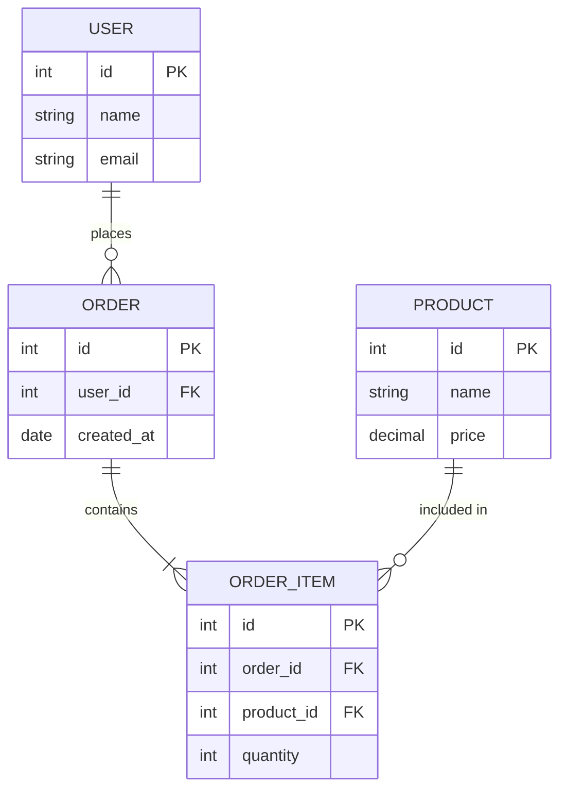

# ERD Diagram

```mermaid
erDiagram
    USER ||--o{ ORDER : places
    ORDER ||--|{ ORDER_ITEM : contains
    PRODUCT ||--o{ ORDER_ITEM : "included in"
    USER {
        int id PK
        string name
        string email
    }
    ORDER {
        int id PK
        int user_id FK
        date created_at
    }
    PRODUCT {
        int id PK
        string name
        decimal price
    }
    ORDER_ITEM {
        int id PK
        int order_id FK
        int product_id FK
        int quantity
    }
```
